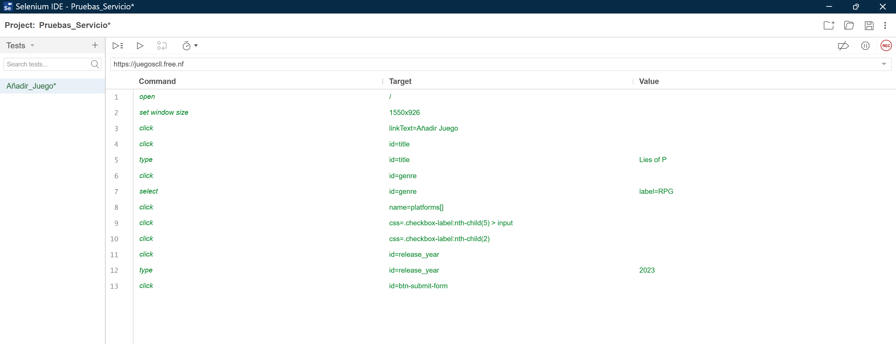
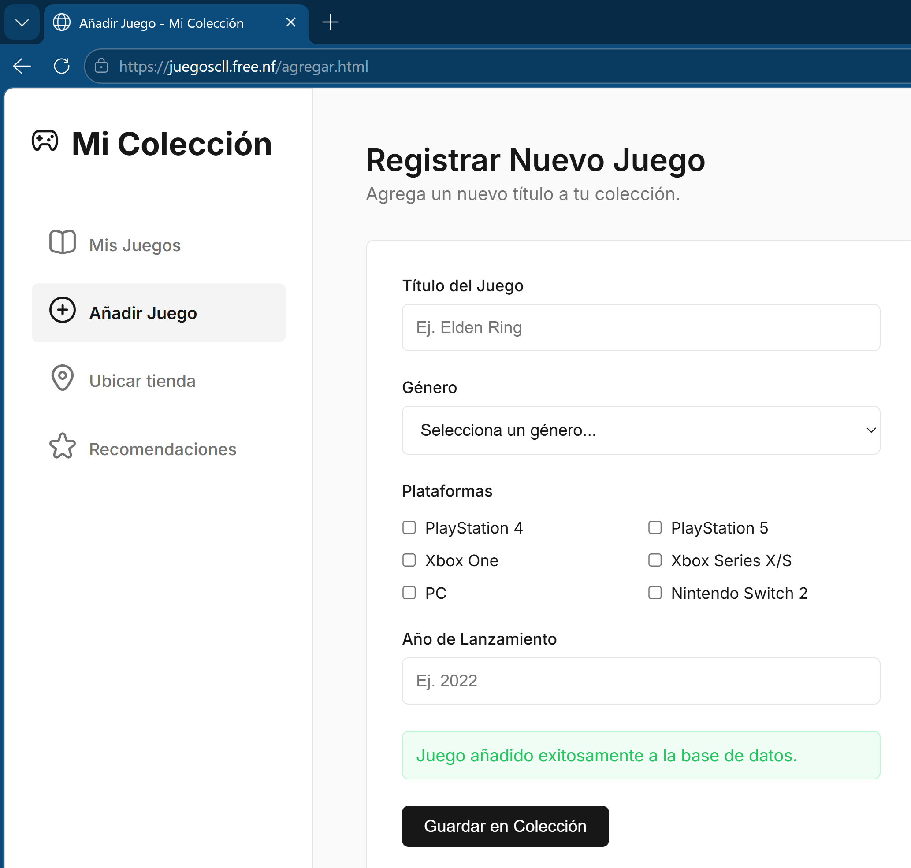
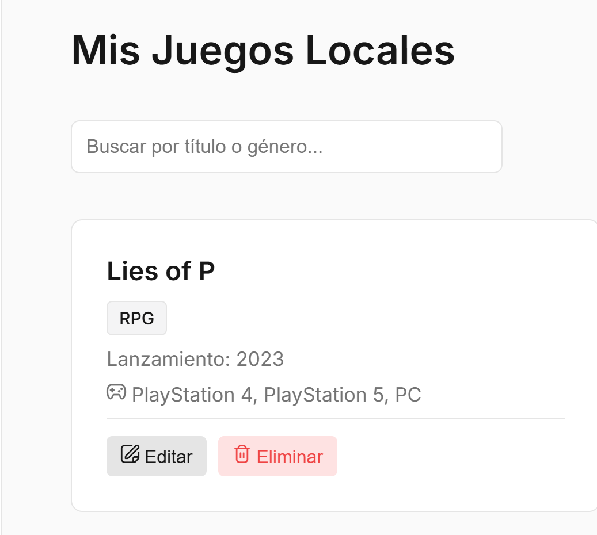
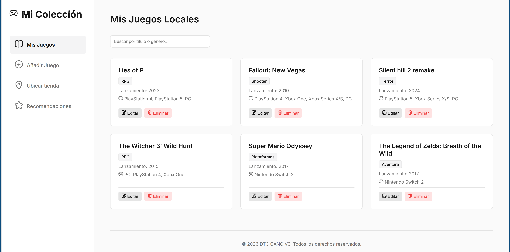
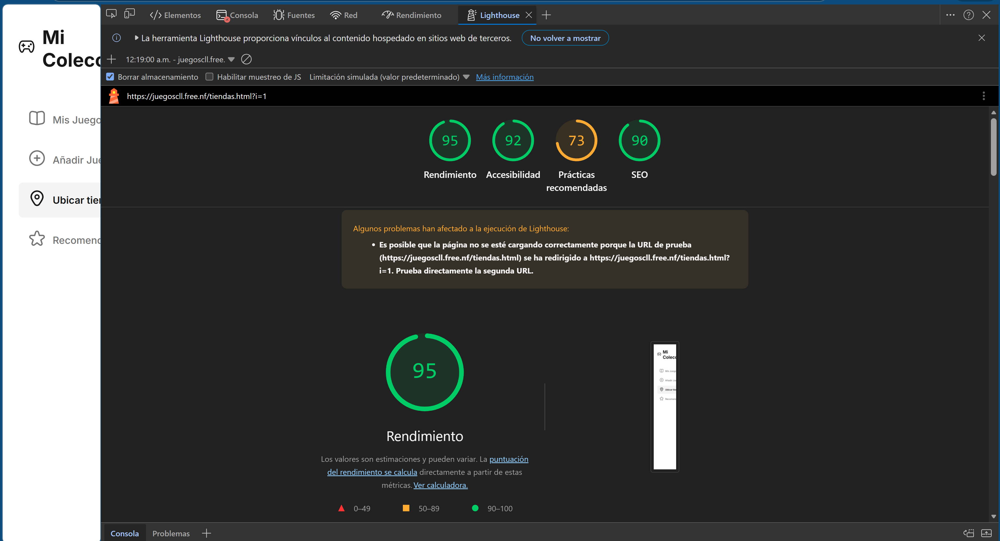
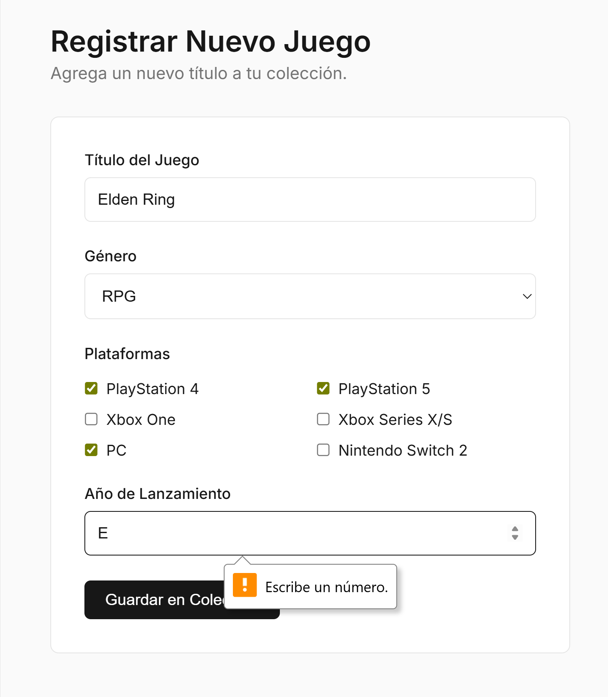
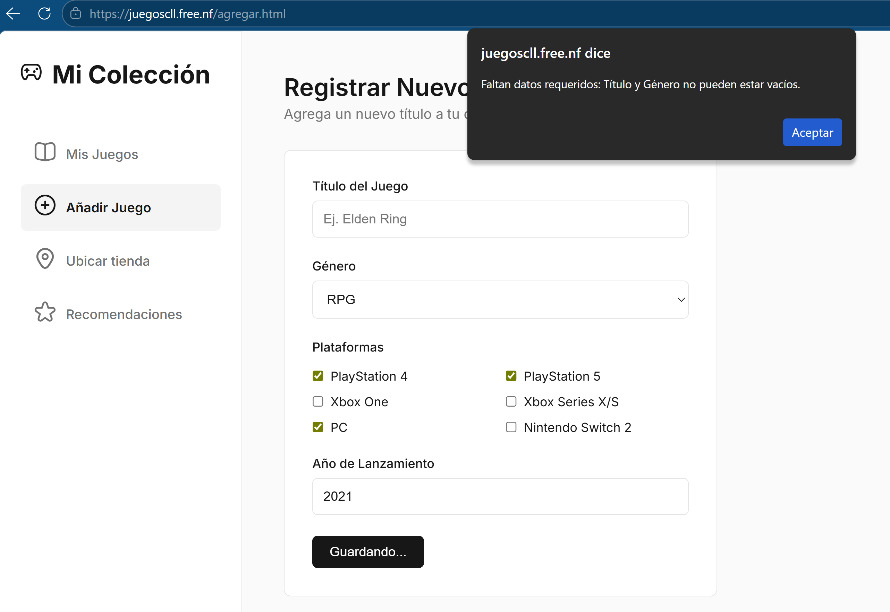

# Pruebas del Proyecto: Mi colección de juegos

## URL del proyecto
https://juegoscll.free.nf/?i=1

## Plan de pruebas
El objetivo de las pruebas es verificar que la aplicación web funcione
correctamente en sus principales funcionalidades. Para ello se probarán
las secciones más importantes del sistema como el formulario para agregar
videojuegos, la visualización de la lista de juegos, la conexión con la
base de datos y el uso de servicios externos como Google Maps.

Las pruebas consisten en ingresar diferentes datos en el formulario para
verificar que la información se guarde correctamente en la base de datos
y se muestre en la lista de videojuegos. También se verificará que el
servicio que devuelve datos en formato JSON funcione correctamente y que
el mapa de Google Maps muestre las tiendas de videojuegos cercanas.

## Criterios de aceptación
Los criterios de aceptación del sistema son los siguientes:

- El sitio web debe cargar correctamente en el navegador.
- El formulario debe permitir agregar videojuegos sin errores.
- Los datos ingresados deben guardarse correctamente en la base de datos.
- La lista de videojuegos debe mostrarse correctamente en la página.
- El servicio que devuelve datos en formato JSON debe funcionar correctamente.
- El mapa de Google Maps debe mostrarse correctamente y permitir visualizar
  tiendas de videojuegos cercanas.
- El sistema debe validar los datos del formulario y mostrar mensajes de
  error cuando los datos no sean correctos.

## Resultados obtenidos de las pruebas

## Prueba 1 – Evaluación del sitio con Lighthouse

**Objetivo:**  
Evaluar el rendimiento, accesibilidad, buenas prácticas y optimización SEO del sitio web.

**Herramienta utilizada:**  
Lighthouse integrado en el navegador Google Chrome.

**Procedimiento:**  
1. Se abrió el sitio web del proyecto en el navegador.
2. Se accedió a las herramientas de desarrollador con Ctrl + Shift + I.
3. Se seleccionó la pestaña Lighthouse.
4. Se ejecutó el análisis seleccionando las categorías Performance, Accessibility, Best Practices y SEO.

**Resultados obtenidos:**

- Performance: 71
- Accessibility: 89
- Best Practices: 90
- SEO: 96

**Interpretación de los resultados:**  
El sitio web funciona bien en general. Aunque la velocidad puede mejorar un poco (71), la accesibilidad (89) y el SEO (90) son buenos, lo que significa que es fácil de usar y se puede encontrar bien en buscadores. Además, las buenas prácticas (96) indican que está bien construido. En general, es un buen sitio, pero se puede mejorar la velocidad para que sea aún mejor.

**Aprobada**

## Prueba 2 – Registro de videojuegos con formulario

**Objetivo:**  
Verificar que el formulario permita registrar videojuegos correctamente.

**Herramienta utilizada:**  
Selenium IDE.

**Procedimiento:**  
1. Se accedió a Selenium IDE.
2. Se ejecutó todo el procedimiento para ingresar los datos de un nuevo juego.
3. Se envió el formulario (desde Selenium IDE).
4. Se comprobó que el registro se realizara correctamente. 

Datos de prueba utilizados:

Nombre: Lies of P
Género: RPG
Año: 2023
Plataforma: Ps4,Ps5,Pc

**Resultado esperado:**  
El sistema debe registrar el videojuego y mostrarlo en la lista de juegos.

**Resultado obtenido:**  
El sistema registró correctamente el videojuego y lo mostró en la lista de juegos almacenados.

**Resultado final:**  
Prueba aprobada.

 

## Prueba 3 – Verificación de almacenamiento en base de datos

**Objetivo:**  
Comprobar que los videojuegos registrados mediante el formulario se almacenen correctamente en la base de datos.

**Herramienta utilizada:**  
Selenium IDE.

**Procedimiento:**  
1. Se accedió a Selenium IDE.
2. Se ejecutó todo el procedimiento para ingresar los datos de un nuevo juego.
3. Se envió el formulario (desde Selenium IDE).
4. Posteriormente se revisó la sección "Mis Juegos".

Datos de prueba utilizados:

Nombre: Lies of P
Género: RPG
Año: 2023
Plataforma: Ps4,Ps5,Pc

**Resultado esperado:**  
El videojuego registrado debe aparecer en la lista de juegos.

**Resultado obtenido:**  
El videojuego se registró correctamente y apareció en la lista de juegos del sistema.

**Resultado final:**  
Prueba aprobada.

 

## Prueba 4 – Visualización de la lista de videojuegos

**Objetivo:**  
Verificar que el sistema muestre correctamente los videojuegos registrados en la base de datos.

**Procedimiento:**  
1. Se accedió a la sección "Mis Juegos".
2. Se revisó la lista de videojuegos registrados previamente en el sistema.

**Resultado esperado:**  
El sistema debe mostrar correctamente la lista de videojuegos almacenados.

**Resultado obtenido:**  
La página mostró correctamente los videojuegos registrados en el sistema.

**Resultado final:**  
Prueba aprobada.

## Prueba 5 – Verificación del servicio JSON

**Objetivo:**  
Comprobar que el sistema utilice servicios que devuelvan datos en formato JSON.

**Procedimiento:**  
1. Se accedió al sitio web del proyecto.
2. Se abrieron las herramientas de desarrollador del navegador.
3. Se revisaron las peticiones de red realizadas por la aplicación.
4. Se verificó que el servidor enviara datos en formato JSON.

**Resultado esperado:**  
El sistema debe devolver información estructurada en formato JSON.

**Resultado obtenido:**  
El sistema respondió correctamente mostrando datos en formato JSON con la información de los videojuegos registrados.

**Resultado final:**  
Prueba aprobada.

## Prueba 6 – Verificación del servicio externo Google Maps

**Objetivo:**  
Comprobar que el sistema utilice correctamente un servicio externo para mostrar la ubicación de tiendas de videojuegos.

**Procedimiento:**  
1. Se accedió a la sección "Ubicar tienda" del sitio web.
2. Se verificó la carga del mapa integrado en la página.
3. Se accedió a las herramientas de desarrollador con Ctrl + Shift + I.
4. Se seleccionó la pestaña Lighthouse.
5. Se ejecutó el análisis seleccionando las categorías Performance, Accessibility, Best Practices y SEO.

**Resultado esperado:**  
El mapa debe mostrarse correctamente permitiendo visualizar ubicaciones de tiendas cercanas.

**Resultado obtenido:**  
El mapa se cargó correctamente dentro del sitio web y permitió visualizar ubicaciones utilizando el servicio de Google Maps.

- Performance: 95
- Accessibility: 92
- Best Practices: 73
- SEO: 90

**Resultado final:**  
Prueba aprobada, el sitio web funciona muy bien y carga rápido (95). También es fácil de usar (92) y se puede encontrar bien en internet (90). Sin embargo, hay algunos detalles técnicos que se pueden mejorar (73). En general, es un buen sitio, pero puede mejorar un poco en esos aspectos.

## Prueba 7 – Validación de datos del formulario

**Objetivo:**  
Verificar que el sistema valide los datos ingresados en el formulario y muestre mensajes de error cuando los datos no sean correctos.

**Procedimiento:**  
1. Se accedió al formulario para agregar videojuegos.
2. Se ingresaron datos incorrectos, dejando campos vacíos o con información inválida.
3. Se intentó enviar el formulario.

**Resultado esperado:**  
El sistema debe mostrar mensajes de error y evitar que se guarden datos incorrectos.

**Resultado obtenido:**  
El sistema invalidó los datos del formulario y mostró mensajes de error cuando los campos no eran correctos.

**Resultado final:**  
Prueba aprobada.

## Conclusión de las pruebas

Después de ejecutar las pruebas del sistema se comprobó que la aplicación web funciona correctamente en sus principales funcionalidades. El sitio carga sin problemas y obtiene buenos resultados en las pruebas realizadas con Lighthouse.

El formulario permite agregar videojuegos correctamente y los datos ingresados se almacenan en la base de datos y se muestran en la lista de juegos dentro del sitio. También se verificó que el servicio que devuelve información en formato JSON funciona adecuadamente.

Además, el sistema integra correctamente el servicio externo de Google Maps para mostrar tiendas de videojuegos cercanas. Finalmente, se comprobó que el sistema valida los datos del formulario y muestra mensajes de error cuando los datos ingresados no son correctos.

En general, las pruebas realizadas permitieron confirmar que el proyecto cumple con los requisitos establecidos y que sus funcionalidades principales operan de forma correcta.

